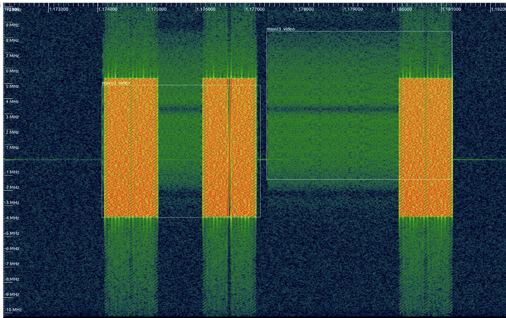
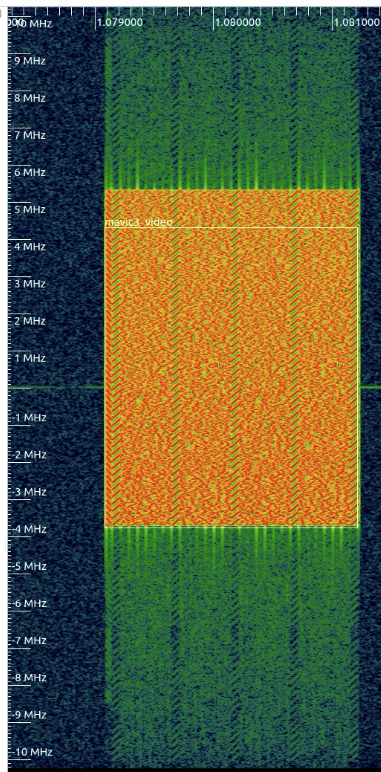
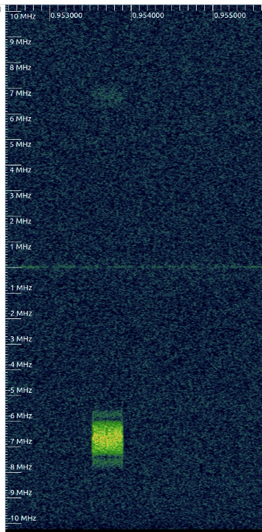

# RFML

This repo provides the pipeline for working with RF datasets, labeling them and training both IQ and spectrogram based models. The SigMF standard is used for managing RF data and the labels/annotations on the data. It also uses the Torchsig framework for performing RF related augmentation of the data to help make the trained models more robust and functional in the real world.
 
[Prerequisites](#prerequisites)

[Virtual environment](#activate-virtual-environment)

[Install](#install)

[Verify install with GPU support](#verify-install-with-gpu-support-optional)

[Building a model](#building-a-model)

[Labelling I/Q data](#labeling-iq-data)

[Training a model](#training-a-model)

[Files](#files)

## Prerequisites

### Poetry

Follow the instructions here to install Poetry: https://python-poetry.org/docs/#installation


### Inspectrum (optional)

https://github.com/miek/inspectrum

This utility is useful for inspecting sigmf files and the annotations that the auto label scripts make.


### Anylabelling (optional)
https://github.com/vietanhdev/anylabeling

This program is used for image annotation and offers AI-assisted labelling. 


## Activate virtual environment 

This project uses Poetry for dependency management and packaging. Poetry can be used with external virtual environments. 
If using a non-Poetry virtual environment, start by activating the environment before running Poetry commands. See note in [Poetry docs](https://python-poetry.org/docs/basic-usage/#using-your-virtual-environment) for more info. 


### Using Poetry

To activate the Poetry virtual environment with all of the Python modules configured, run the following:

```bash
poetry shell
```
See [Poetry docs](https://python-poetry.org/docs/basic-usage/#activating-the-virtual-environment) for more information. 

## Install

```bash
git clone https://github.com/IQTLabs/rfml-dev.git
cd rfml-dev
git submodule update --init --recursive
poetry install
```

## Verify install with GPU support (optional)

```bash
$ python -c 'import torch; print(torch.cuda.is_available())'
True
```

If the output does not match or errors occur, try installing Pytorch manually ([current version](https://pytorch.org/get-started/locally/) or [previous versions](https://pytorch.org/get-started/previous-versions/)).
#### Example

```bash
pip install torch==2.0.1 torchvision==0.15.2
```


# Building a model


## Approach

Our current approach is to capture examples of signals of interest to create labeled datasets. There are many methods for doing this and many challenges to consider. One practical method for accomplishing this is to isolate signals of interest and compare those to a specific background RF environment. For simplicity we apply the same label to all the signals present in the background environment samples. We use this to essentially teach the model to ignore those signals. For this to work, it is important that the signals of interest are isolated from the background RF environment. Since it is really tough these days to find an RF free environment, we have build a mini-faraday cage enclosure by lining the inside of a pelican case with foil. There are lots of instructions, like [this one](https://mosequipment.com/blogs/blog/build-your-own-faraday-cage), available online if you want to build your own. With this, the signal will be very strong, so make sure you adjust the SDR's gain appropriately.

## Labeling IQ Data

The scripts in [label_scripts](./label_scripts/) use signal processing to automatically label IQ data. The scripts looks at the signal power to detect when there is a signal present in the IQ data and estimate the occupied bandwidth of the signal. 

### Tuning Autolabeling

In the labeling scripts, the settings for autolabeling need to be tuned for the type of signals that were collected.

```python
annotation_utils.annotate(
                f, 
                label="mavic3_video",               # This is the label that is applied to all of the matching annotations
                avg_window_len=256,                 # The number of samples over which to average signal power
                avg_duration=0.25,                  # The number of seconds, from the start of the recording to use to automatically calculate the SNR threshold, if it is None then all of the samples will be used
                debug=False,    
                set_bandwidth=10000000,            # Manually set the bandwidth of the signals in Hz, if this parameter is set, then spectral_energy_threshold is ignored
                spectral_energy_threshold=0.95,     # Percentage used to determine the upper and lower frequency bounds for an annotation
                force_threshold_db=-58,             # Used to manually set the threshold used for detecting a signal and creating an annotation. If None, then the automatic threshold calculation will be used instead.
                overwrite=False,                    # If True, any existing annotations in the .sigmf-meta file will be removed
                min_bandwidth=16e6,                 # The minimum bandwidth (in Hz) of a signal to annotate
                max_bandwidth=None,                 # The maximum bandwidth (in Hz) of a signal to annotate
                min_annotation_length=10000,        # The minimum numbers of samples in length a signal needs to be in order for it to be annotated. This is directly related to the sample rate a signal was captured at and does not take into account bandwidth. So 10000 samples at 20,000,000 samples per second, would mean a minimum transmission length of 0.0005 seconds
                # max_annotations=500,              # The maximum number of annotations to automatically add  
                dc_block=True                       # De-emphasize the DC spike when trying to calculate the frequencies for a signal
            )
```

### Tips for Tuning Autolabeling

#### Force Threshold dB


If you see annotations where harmonics or lower power, unintentional signals are getting selected, try setting the `force_threshold_db`. The automatic threshold calculation maybe selecting a value that is too low. Find a value for `force_threshold_db` where it is selecting the intended signals and ignoring the low power ones.

#### Spectral Energy Threshold


If the frequency bounds are not lining up with the top or bottom part of a signal, make the `spectral_energy_threshold` higher. Sometime a setting as high as 0.99 is required 

#### Skipping "small" Signals


Some tuning is needed for signals that have a short transmission duration and/or limited bandwidth. Here are a couple things to try if they are getting skipped:
- `min_annotation_length` is the minimum number of samples for an annotation. If the signal is has less samples than this, it will not be annotated. Try lowering this.
- The `average_duration` setting maybe too long and the signal is getting averaged into the noise. Try lowering this.
- `min_bandwidth` is the minimum bandwidth (in Hz) for a signal to be detected. If this value is too high, signals that have less bandwidth will be ignored. Try lowering this.

## Training a Model

After you have finished labeling your data, the next step is to train a model on it. This repo makes it easy to train both IQ and Spectrogram based models from sigmf data. 

### Configure

This repo provides an automated script for training and evaluating models. To do this, configure the [run_experiments.py](rfml/run_experiments.py) file to point to the data you want to use and set the training parameters:

```python
    "experiment_0": { # A name to refer to the experiment
        "class_list": ["mavic3_video","mavic3_remoteid","environment"], # The labels that are present in the sigmf-meta files
        "train_dir": ["data/samples/mavic-30db", "data/samples/mavic-0db", "data/samples/environment"], # Directory with SigMF files
        "iq_epochs": 10, # Number of epochs for IQ training, if it is 0 or None, it will be skipped
        "spec_epochs": 10, # Number of epochs for spectrogram training, if it is 0 or None, it will be skipped
        "notes": "DJI Mavic3 Detection" # Notes to your future self
    }
```

Once you have the **run_experiments.py** file configured, run it:

```bash
python3 run_experiments.py
```

Once the training has completed, it will print out the logs location, model accuracy, and the location of the best checkpoint: 

```bash
I/Q TRAINING COMPLETE


Find results in experiment_logs/experiment_1/iq_logs/08_08_2024_09_17_32

Total Accuracy: 98.10%
Best Model Checkpoint: lightning_logs/version_5/checkpoints/experiment_logs/experiment_1/iq_checkpoints/checkpoint.ckpt
```

### Convert & Export IQ Models

Once you have a trained model, you need to convert it into a portable format that can easily be served by TorchServe. To do this, use **convert_model.py**:

```bash
python3 convert_model.py --model_name=drone_detect --checkpoint=lightning_logs/version_5/checkpoints/experiment_logs/experiment_1/iq_checkpoints/checkpoint.ckpt
```
This will export a **_torchscript.pt** file.

```bash
torch-model-archiver --force --model-name drone_detect --version 1.0 --serialized-file weights/drone_detect_torchscript.pt --handler custom_handlers/iq_custom_handler.py  --export-path models/ -r custom_handler/requirements.txt
```

This will generate a **.mar** file in the [models/](./models/) folder. [GamutRF](https://github.com/IQTLabs/gamutRF) can run this model and use it to classify signals.

## Files


[annotation_utils.py](rfml/annotation_utils.py) - DSP based automated labelling tools

[auto_label.py](rfml/auto_label.py) - CV based automated labelling tools

[data.py](rfml/data.py) - RF data operations tool

[experiment.py](rfml/experiment.py) - Class to manage experiments 

[models.py](rfml/models.py) - Class for I/Q models (based on TorchSig) 

[run_experiments.py](rfml/run_experiments.py) - Experiment configurations and run script

[sigmf_pytorch_dataset.py](rfml/sigmf_pytorch_dataset.py) - PyTorch style dataset class for SigMF data (based on TorchSig) 

[spectrogram.py](rfml/spectrogram.py) - Spectrogram tools 

[test_data.py](rfml/test_data.py) - Test for data.py (might be outdated)

[train_iq.py](rfml/train_iq.py) - Training script for I/Q models

[train_spec.py](rfml/train_spec.py) - Training script for spectrogram models

[zst_parse.py](rfml/zst_parse.py) - ZST file parsing tool, for GamutRF-style filenames  

The [notebooks/](./notebooks/) directory contains various experiments we have conducted during development.

