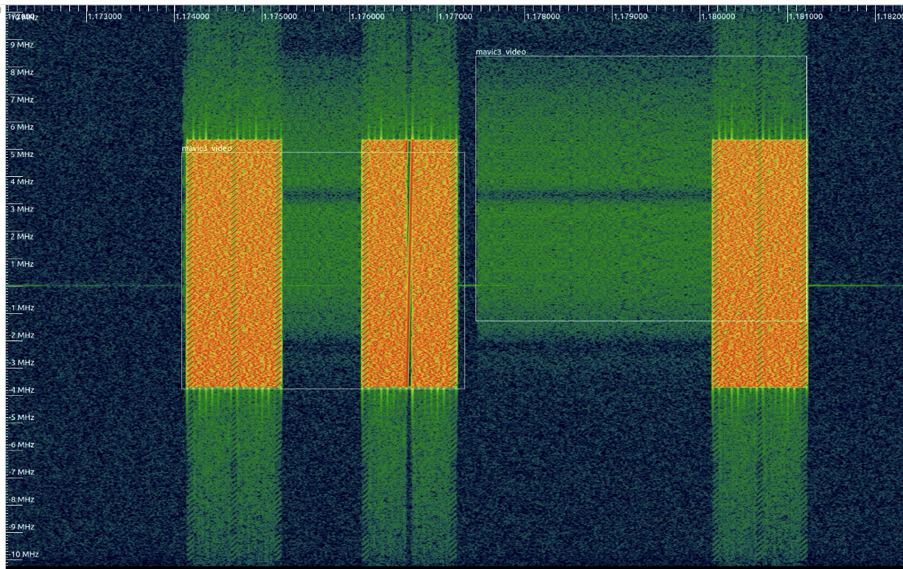
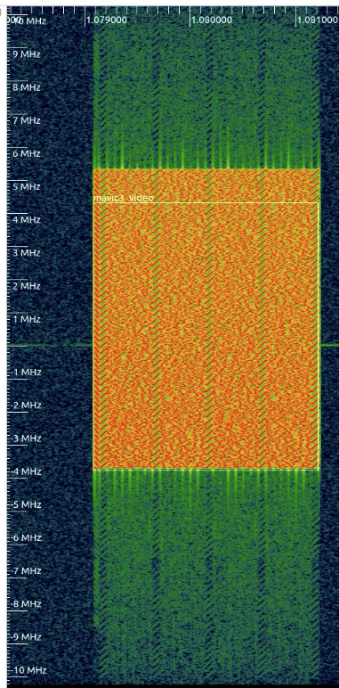
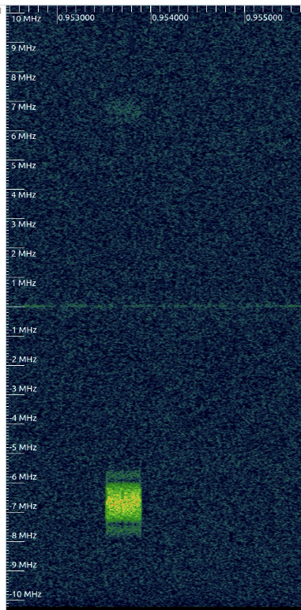

# Preqs

## Poetry

## Torchsig

Download and install from [Github](https://github.com/TorchDSP/torchsig)

```
git clone https://github.com/TorchDSP/torchsig.git
cd torchsig
sudo pip install .
```


# Building a Model


## Approach

Our current approach is to capture samples of the background RF environment and then also isolate signals of interest and capture samples of each of the signals. The same label will be applied to all of the signals present in the background environment samples. We use this to essentially teach the model to ignore those signals. For this to work, it is important that none of the signals of interest are present. Since it is really tough these days to find an RF free environment, we have build a mini-faraday cage enclosure by lining the inside of a pelican case with foil. There are lots of instructions, like [this one](https://mosequipment.com/blogs/blog/build-your-own-faraday-cage), available online if you want to build your own. With this, the signal will be very strong, so make sure you adjust the SDR's gain appropriately.

## Labeling IQ Data

The scripts in the [label_scripts](./label_scripts/) use signal processing to automatically label IQ data. The scripts looks at the signal power to detect when there is a signal present in the IQ data. When a signal is detected, the script will look at the frequencies for that set of samples and find the upper and lower bounds.


### Annotation Explained

```python
annotation_utils.annotate(
                f, 
                label="mavic3_video",               # This is the label that is applied to all of the matching annotations
                avg_window_len=256,                 # The number of samples over which to average signal power
                avg_duration=0.25,                  # The number of seconds, from the start of the recording to use to automatically calculate the SNR threshold, if it is None then all of the samples will be used
                debug=False,    
                estimate_frequency=True,            # Whether the frequency bounds for an annotation should be calculated. estimate_frequency needs to be enabled if you use min/max_bandwidth
                spectral_energy_threshold=0.95,     # Percentage used to determine the upper and lower frequency bounds for an annotation
                force_threshold_db=-58,             # Used to manually set the threshold used for detecting a signal and creating an annotation. If None, then the automatic threshold calcuation will be used instead.
                overwrite=False,                    # If True, any existing annotations in the .sigmf-meta file will be removed
                min_bandwidth=16e6,                 # The minimum bandwidth (in Hz) of a signal to annotate
                max_bandwidth=None,                 # The maximum bandwidth (in Hz) of a signal to annotate
                min_annotation_length=10000,        # The minimum numbers of samples in length a signal needs to be in order for it to be annotated. This is directly related to the sample rate a signal was captured at and does not take into account bandwidth. So 10000 samples at 20,000,000 samples per second, would mean a minimum transmission length of 0.0005 seconds
                # max_annotations=500,              # The maximum number of annotations to automatically add  
                dc_block=True                       # De-emphasize the DC spike when trying to calculate the frequencies for a signal
            )
```

### Configuring Annotation

#### Force Threshold dB


If you see annotations where harmonics or lower power, unintentional signals are getting selected, try setting the `force_threshold_db`. The automatic threshold calculation maybe selecting a value that is too low. Find a value for `force_threshold_db` where it is selecting the intended signals and ignoring the low power ones.

#### Spectral Energy Threshold


If the frequency bounds are not lining up with the top or bottom part of a signal, make the `spectral_energy_threshold` higher. Sometime a setting as high as 0.99 is required 

#### Skipping "small" Signals


Some tuning is needed for signals that have a short transmission duration and/or limited bandwidth. Here are a couple things to try if they are getting skipped:
- `min_annotation_length` is the minimum number of samples for an annotation. If the signal is has less samples than this, it will not be annotated. Try lowering this.
- The `average_duration` setting maybe too long and the signal is getting averaged into the noise. Try lowering this.
- `min_bandwidth` is the minimum bandwidth (in Hz) for a signal to be detected. If this value is too high, signals that have less bandiwdth will be ignored. Try lowering this.


## Files

[annotation_utils.py](annotation_utils.py) - DSP based automated labelling tools

[auto_label.py](auto_label.py) - CV based automated labelling tools

[data.py](data.py) - RF data operations tool

[experiment.py](experiment.py) - Class to manage experiments 

[models.py](models.py) - Class for I/Q models (based on TorchSig) 

[run_experiments.py](run_experiments.py) - Experiment configurations and run script

[sigmf_pytorch_dataset.py](sigmf_pytorch_dataset.py) - PyTorch style dataset class for SigMF data (based on TorchSig) 

[spectrogram.py](spectrogram.py) - Spectrogram tools 

[test_data.py](test_data.py) - Test for data.py (might be outdated)

[train_iq.py](train_iq.py) - Training script for I/Q models

[train_spec.py](train_spec.py) - Training script for spectrogram models

[zst_parse.py](zst_parse.py) - ZST file parsing tool, for GamutRF-style filenames  


## Should be removed 

[wifi_label_utils.py](wifi_label_utils.py) - Old version of annotation_utils.py

[sigmf_db_dataset.py](sigmf_db_dataset.py) - TorchSig class for pickle based dataset (NOT USED) 


